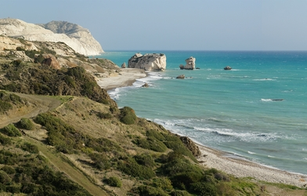

# Multi-CAST Cypriot Greek

## How to cite

If you use these data please cite
- the original source
  > Hadjidas, Harris & Vollmer, Maria. 2019. Multi-CAST Cypriot Greek. In Haig, Geoffrey & Schnell, Stefan (eds.), Multi-CAST: Multilingual corpus of annotated spoken texts. Version 1905. Bamberg: University of Bamberg. (multicast.aspra.uni-bamberg.de/#cypgreek) (date accessed)
- the derived dataset using the DOI of the [particular released version](../../releases/) you were using



## Description


**Cypriot Greek** ([cypr1249](https://glottolog.org/resource/languoid/id/cypr1249)) is the variety of Greek spoken in Cyprus. The three texts in this corpus, all of which are traditional narratives, were originally recorded in the 1960s, and later compiled and published by Konstantinos Giangoullis as part of a book of traditional Cypriot tales ([Giangoullis 2009](Source#cldf:giangoullis2009)). The author of the text collection, Konstantinos Giangoullis, has kindly given his permission for the three texts in this corpus to be made freely available as part of Multi-CAST.

While unfortunately no audio recordings are available for this corpus, the texts appear to have been only minimally edited and reflect reasonably faithfully the spoken language used in traditional narratives. The texts were initially transliterated into the Roman alphabet and translated into English by a native speaker, Harris Hadjidas, who also conducted the first round of syntactic annotation. A second round of annotation was completed by Maria Vollmer under the supervision of Geoffrey Haig.

This dataset is licensed under a CC-BY-4.0 license

Available online at https://multicast.aspra.uni-bamberg.de/#cypgreek


```geojson
{
    "type": "FeatureCollection",
    "features": [
        {
            "type": "Feature",
            "geometry": {
                "type": "Point",
                "coordinates": [
                    32.978113,
                    34.924591
                ]
            }
        },
        {
            "type": "Feature",
            "geometry": {
                "type": "Polygon",
                "coordinates": [
                    [
                        [
                            27.978113,
                            39.924591
                        ],
                        [
                            37.978113,
                            39.924591
                        ],
                        [
                            37.978113,
                            29.924591
                        ],
                        [
                            27.978113,
                            29.924591
                        ],
                        [
                            27.978113,
                            39.924591
                        ]
                    ]
                ]
            }
        }
    ]
}
```


## Corpus metadata

- [Annotation notes](cldf/media/annotation-notes.pdf)
- [Metadata](cldf/media/metadata.pdf)
- [Translated texts](cldf/media/translated-texts.pdf)


## CLDF Datasets

The following CLDF datasets are available in [cldf](cldf):

- CLDF [TextCorpus](https://github.com/cldf/cldf/tree/master/modules/TextCorpus) at [cldf/TextCorpus-metadata.json](cldf/TextCorpus-metadata.json)